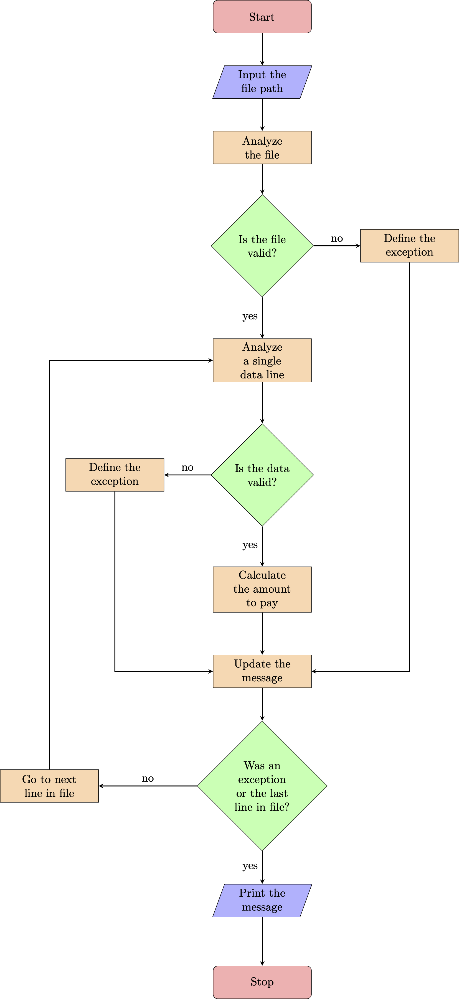

# Exercise

The company ACME offers their employees the flexibility to work the hours they want.
They will pay for the hours worked based on the day of the week and time of day, according to the following table:

**Monday - Friday**
- 00:01 - 09:00 25 USD
- 09:01 - 18:00 15 USD
- 18:01 - 00:00 20 USD

**Saturday and Sunday**
- 00:01 - 09:00 30 USD
- 09:01 - 18:00 20 USD
- 18:01 - 00:00 25 USD

The goal of this exercise is to calculate the total that the company has to pay an employee, 
based on the hours they worked and the times during which they worked.
The following abbreviations will be used for entering data:
- MO: Monday
- TU: Tuesday
- WE: Wednesday
- TH: Thursday
- FR: Friday
- SA: Saturday
- SU: Sunday

**Input:** The name of an employee and the schedule they worked, indicating the time and hours.
This should be a .txt file with at least five sets of data. You can include the data from our two examples below.

**Output:** Indicate how much the employee has to be paid

For example:

- Case 1:

  - INPUT
  
    RENE=MO10:00-12:00,TU10:00-12:00,TH01:00-03:00,SA14:00-18:00,SU20:00-21:00

  - OUTPUT:
  
    The amount to pay RENE is: 215 USD

- Case 2:

  - INPUT

    ASTRID=MO10:00-12:00,TH12:00-14:00,SU20:00-21:00

  - OUTPUT:
  
    The amount to pay ASTRID is: 85 USD

# Solution

Before we start coding a solution for the actual problem, let's break it into smaller pieces, let's call them 
__Milestones__. After we get all the milestones required for solving the problem we're going to need some __Conditions__
which need to be considered for preventing some bugs or a crash.

### Milestones:

1. We need to read a txt file where we have in each line the employee's name and schedule.
2. Each line of the file has the employee's name and schedule considering a specific string structure.
3. The name-schedule separator is the equal symbol (=).
4. The schedule separator is the comma symbol (,).
5. For calculating the employee payment, we need to consider different payment value for each hour depending on the day.

### Conditions:

Considering the problem statement and the __Milestones__ we can generate some conditions that must be checked during the
run in order to receive the required message:
1. The provided file must be a txt file.
2. The provided txt file must be of at least five sets of data.
3. Each employee data must have a specific string structure.
4. Considering the final objective of the script, we need to ensure that there isn't the same name for more than one
employee.
5. In order to prevent an error by the user, we need to make sure that we don't have a duplicated week-day for an 
employee.
6. In order to prevent a conflict with the financial department and the employees, we're going to consider that each
daily schedule is going to start at the time x hours : 0 minutes and is going to finish at the time y hours : 0 minutes.
In order to work with times which doesn't have 0 minutes, we need a round clarification from the financial department.
7. We need to check that there isn't an employee data with an hour greater than 23:00, because it doesn't exists.
8. And finally we need to check that the start time is less than the finish time.

### Exceptions:

Let's go deeply in some conditions trying to raise an exception when a condition check has not passed, so we can work 
with custom exceptions and messages:
- `FileTypeError`: Exception raised when the file is not a txt file.
- If the given file has less than 5 sets of data, then we're going to see a custom message "The file must have at least 
five sets of data."
- `DataStructureError`: Exception raised for errors when single data does not have the structure given in the exercise 
statement.
- If the given file has a duplicated employee name, then we're going to see a custom message "Error: The employee XYZ 
appears more than once."
- `DuplicatedDayError`: Exception raised for errors when single data contains a duplicated day.
- `InvalidHourError`: Exception raised for errors when single data contains an invalid hour.
- `LimitHourError`: Exception raised for errors when single data contains an invalid limit hour.

One way to accomplish the __Milestones__ considering the __Conditions__ and __Exceptions__ is by using a process like 
the following:

First of all I created a method for analyzing if a path corresponds to a txt file (`main.check_file`), if the path 
doesn't correspond to a txt file then `FileTypeError` is going to be raised, but if it's a txt file, then we can proceed 
to the payment calculation by reading the given file.

In this step we're going to read each line and analyzing each of them considering the __Conditions__ and __Exceptions__,
they're going to be encapsulated in the method `main.full_calculate_payment`. If a data line (single employee data) 
passes all the validations then we're going to store the message in the variable `result` defined in 
`main.full_calculate_payment`.

# How to run the program locally

1. Install Python 3.7.6 or higher in your local machine using pyenv
(Follow the instructions in [Real Python](https://realpython.com/intro-to-pyenv/)). If you don't want to use pyenv nor 
other tool for managing multiple Python versions, you can install Python directly into your machine following the 
instructions provided by Python.org ([python.org](https://www.python.org/downloads/release/python-376/)).
2. Run terminal (for Linux and MacOS users), cmd (for Windows users).
3. Access the folder where you want to copy the repository, create a new folder if needed.
4. Run the command `git clone git@github.com:armando310388/ioet_project01.git`, enter your passphrase for key when 
asked.
5. If you used pyenv in step 1, then you need to activate this python environment.
6. For running the app, you can use the command `python main.py` 
(In some cases the command should be `python3 main.py`).
7. Follow the instructions shown by the app.

For running the tests you can use the command `python tests.py` 
(In some cases the command should be `python3 tests.py`).
